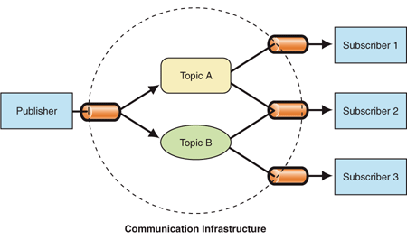

# redis之mq實現發布訂閱模式



## 概述

Redis不僅可作為緩存服務器，還可用作消息隊列，本示例演示如何使用redis實現發布/訂閱消息隊列。

- 在Redis中，發布者沒有將消息發送給特定訂閱者的程序。相反，發布的消息被描述為通道，而不知道(如果有的話)可能有哪些訂閱者。
- 訂閱者表示對一個或多個主題感興趣，只接收感興趣的消息，而不知道(如果有的話)發布者是什麼。
- 發布者和訂閱者的這種解耦可以實現更大的可伸縮性和更動態的網絡拓撲。

## 代碼實現

redis實現mq的存儲方式很多，可以使用list,zset及stream，這些數據的存儲結構決定了怎麼消費問題（消息是一次使用、允許多次使用、允許多端消息等），比如使用list，我們可以使用leftPush插入消息，使用rightPop消費消息，實現一條消息一次消費，可以參考與以示例代碼：

````java
    @Test
    public void testMq() {
        for (int i = 0; i < 10; i++) {
            redisTemplate.opsForList().leftPush("task-queue", "data" + i);
            log.info("插入了一個新的任務==>{}", "data" + i);
        }
        String taskId = redisTemplate.opsForList().rightPop("task-queue").toString();
        log.info("處理成功，清除任務==>{}", taskId);
    }
````

### 1.配置代碼RedisConfig.java

```java
package com.ctbcbank.aigo.dataAccess.mqRedis.config;

import org.springframework.beans.factory.annotation.Autowired;
import org.springframework.cache.annotation.CachingConfigurerSupport;
import org.springframework.cache.annotation.EnableCaching;
import org.springframework.context.annotation.Bean;
import org.springframework.context.annotation.Configuration;
import org.springframework.data.redis.connection.RedisConnectionFactory;
import org.springframework.data.redis.core.RedisTemplate;
import org.springframework.data.redis.core.StringRedisTemplate;
import org.springframework.data.redis.listener.ChannelTopic;
import org.springframework.data.redis.listener.RedisMessageListenerContainer;
import org.springframework.data.redis.listener.adapter.MessageListenerAdapter;
import org.springframework.data.redis.serializer.GenericJackson2JsonRedisSerializer;
import org.springframework.data.redis.serializer.StringRedisSerializer;

@Configuration
@EnableCaching
public class RedisConfig extends CachingConfigurerSupport {

    @Autowired
    private RedisTemplate redisTemplate;

    /**
     * redisTemplate 序列化使用的jdkSerializeable, 存儲二進製字節碼, 所以自定義序列化類,方便調試redis
     *
     * @param redisConnectionFactory
     * @return
     */
    @Bean
    public RedisTemplate<String, Object> redisTemplate(RedisConnectionFactory redisConnectionFactory) {

        RedisTemplate<String, Object> redisTemplate = new RedisTemplate<>();

        //使用Jackson2JsonRedisSerializer來序列化和反序列化redis的value值
        redisTemplate.setValueSerializer(new GenericJackson2JsonRedisSerializer());
        redisTemplate.setHashValueSerializer(new GenericJackson2JsonRedisSerializer());

        //使用StringRedisSerializer來序列化和反序列化redis的key
        redisTemplate.setKeySerializer(new StringRedisSerializer());
        redisTemplate.setHashKeySerializer(new StringRedisSerializer());

        //開啟事務
        redisTemplate.setEnableTransactionSupport(true);

        redisTemplate.setConnectionFactory(redisConnectionFactory);

        return redisTemplate;
    }

    @Bean
    MessageListenerAdapter messageListener() {
        return new MessageListenerAdapter(new RedisMessageSubscriber());
    }

    @Bean
    RedisMessageListenerContainer container(RedisConnectionFactory connectionFactory,
                                            MessageListenerAdapter listenerAdapter) {

        RedisMessageListenerContainer container = new RedisMessageListenerContainer();
        container.setConnectionFactory(connectionFactory);
        container.addMessageListener(listenerAdapter, topic());

        return container;
    }

    @Bean
    MessagePublisher redisPublisher() {
        return new RedisMessagePublisher(redisTemplate, topic());
    }

    @Bean
    ChannelTopic topic() {
        return new ChannelTopic("messageQueue");
    }
}

```

### 2.定義消息發布接口MessagePublisher.java

```java
package com.ctbcbank.aigo.dataAccess.mqRedis.config;

public interface MessagePublisher {
    void publish(String message);
}
```

### 3.發布方實現RedisMessagePublisher.java

```java
package com.ctbcbank.aigo.dataAccess.mqRedis.config;

import org.springframework.beans.factory.annotation.Autowired;
import org.springframework.data.redis.core.RedisTemplate;
import org.springframework.data.redis.listener.ChannelTopic;

/**
 * 消息發布方
 */
public class RedisMessagePublisher implements MessagePublisher {

    @Autowired
    private RedisTemplate<String, Object> redisTemplate;

    @Autowired
    private ChannelTopic topic;

    public RedisMessagePublisher(
            RedisTemplate<String, Object> redisTemplate, ChannelTopic topic) {
        this.redisTemplate = redisTemplate;
        this.topic = topic;
    }

    public void publish(String message) {
        redisTemplate.convertAndSend(topic.getTopic(), message);
    }
}
```

### 4.消息接收方RedisMessageSubscriber.java

````java
package com.ctbcbank.aigo.dataAccess.mqRedis.config;

import lombok.extern.slf4j.Slf4j;
import org.springframework.data.redis.connection.Message;
import org.springframework.data.redis.connection.MessageListener;
import org.springframework.stereotype.Service;

import java.util.ArrayList;
import java.util.List;

/**
 * 消息訂閱方
 */
@Service
@Slf4j
public class RedisMessageSubscriber implements MessageListener {

    public static List<String> messageList = new ArrayList<>();

    public void onMessage(Message message, byte[] pattern) {
        messageList.add(message.toString());
        log.info("訂閱方接收到了消息==>{}", message.toString());
    }
}
````

### 5.最後貼上application.yml配置

```yaml
spring:
  redis:
    host: 127.0.0.1
    port: 6379
    password:
```

## 查看運行結果

### 1.編寫測試用例試發布消息TestRedisMQ.java

```java
package com.ctbcbank.aigo.dataAccess.mqRedis;

import com.ctbcbank.aigo.dataAccess.mqRedis.config.RedisMessagePublisher;
import lombok.extern.slf4j.Slf4j;
import org.junit.Test;
import org.junit.runner.RunWith;
import org.springframework.beans.factory.annotation.Autowired;
import org.springframework.boot.test.context.SpringBootTest;
import org.springframework.test.context.junit4.SpringRunner;

import java.util.UUID;

@RunWith(SpringRunner.class)
@SpringBootTest
@Slf4j
public class TestRedisMQ {

    @Autowired
    RedisMessagePublisher redisMessagePublisher;

    @Test
    public void testMq() {
        String message = "Message " + UUID.randomUUID();
        redisMessagePublisher.publish(message);
    }
}
```

### 2.運行結果

```cfml
2019-09-05 15:51:33.931 INFO 10772 --- [ container-2] d.d.m.config.RedisMessageSubscriber : 訂閱方接收到了消息==>"Message c95959bf-6c30-4801-bc80-0e1e3c9f81bc"
```

訂閱方成功接收到消息了
